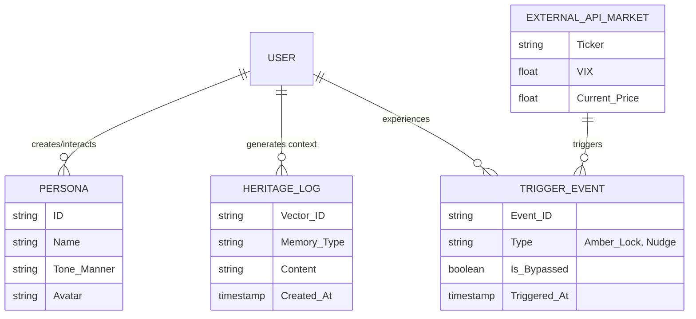

# Vesper (베스퍼) - Action-Master AI Companion OS PRD v1.0 (최종 보완본)
- Owner 팀: Vesper Product Team
- 최종 업데이트: 2026-04-11
- 보완 근거: `04_PRD_Quality_Inspection_Sheet_v2.md` 감사 보고서 (HOLD → PASS 전환)

## 1. 개요·목표

### 문제 정의 (Pain & Needs)
*   **Pain 1:** 치열한 투자/성장 여정 속에서 혼자 감당해야 하는 짙은 고독과 외로움, 그리고 위기 상황에서의 극심한 불안감. 언제나 내 편이 되어줄 '평생의 친구'에 대한 강렬한 결핍.
    *   **실패 KPI:** 위기 도래 시 일일 활성 사용자(DAU) 이탈률 15% 이상, 패닉 셀 전환 비율 40% 이상. 평시 옴니채널 안부 메시지 무반응률 30% 이상.
    *   *측정 경로:* Mixpanel Event `App_Uninstalled`, `Order_Sell_Executed (Holding_Period < 30일)`, `Omni_Message_No_Reply`.
*   **Pain 2:** 추상적인 위로나 가상의 조언에 그치는 한계. 나의 성향과 약점을 완벽히 이해하고, 투자·학습·커리어 등 내가 원하는 실제 꿈을 이루도록 '실질적 성과'를 직접 행동으로 리딩해주는 실무형 단짝(코치)의 부재.
    *   **실패 KPI:** 실무 행동 솔루션(리포트/강의 큐레이션, 타점 제안 등) 클릭-투-액션 전환율 5% 미만, 잔존율(Day-30) 20% 이하.
    *   *측정 경로:* Adjust/Branch 단기 링크 `B2B_Curated_Link_Clicked`.

### 목표 (Desired Outcome)
*   "절대적 정서 락인(Lock-in)" 구축 및 이를 바탕으로 유저의 실제 꿈(투자, 커리어, 학습) 실현을 행동으로 이끌어주는 실무적 파트너로서 포지셔닝(B2B 제휴/구독 수익 창출).

### 성공 지표 (듀얼 북극성 KPI / 보조 KPI)

Vesper의 핵심 가치는 **'평시의 일상 교감(Lock-in)'**과 **'위기 시의 초밀착 개입(Protection)'** 두 축으로 구성됩니다. 한쪽만 측정하면 제품의 절반만 보는 것이므로, 북극성을 2개로 분리합니다.

*   **북극성 KPI ① (일상 교감 락인):** **"페르소나 동반 성장률 (Companion Bond Rate)"**
    *   **정의:** 주 단위로 옴니채널(앱 + SMS/카톡/이메일) 중 **2개 이상의 채널**에서 페르소나와 능동적으로 교감(대화 3회 이상)하며, 페르소나가 유저의 과거 맥락을 활용한 맞춤 대화를 수행하는 유저 비율.
    *   **왜 이 지표인가:** 단순 앱 내 채팅 횟수가 아니라, '앱 밖에서도 일상으로 침투하여 함께 성장하고 있다'는 것을 증명하는 복합 지표. 이 수치가 높다면 페르소나가 단순 챗봇이 아닌 '평생의 친구'로서 심리적 락인(Lock-in)을 완성했음을 뜻함.
    *   **측정 주기:** 주 단위.
    *   **기준선 → 목표값:** Base 0% (런칭 전) ➔ **Target 40%** (출시 후 90일).
    *   **측정 경로:** Mixpanel Cohort `Omni_MultiChannel_Active_3conv_Week` (조건: `channels_used >= 2 AND conversations >= 3 AND persona_context_hit = true`).

*   **북극성 KPI ② (일상 시간 점유):** **"일일 고객 시간 점유율 (Daily Time Share)"**
    *   **정의:** 유저가 하루 중 Vesper(앱 내 대화 + 옴니채널 메시지 읽기/응답)에 **능동적으로 소비하는 총 시간(분)**의 주간 평균.
    *   **왜 이 지표인가:** Crisis Acceptance Rate는 급락장이라는 드문 이벤트에서만 측정 가능하여 상시 북극성으로 부적합. 반면 '일일 시간 점유율'은 매일 발생하며, 유저 일상에 Vesper가 얼마나 깊이 침투해 있는지를 직접 반영함. 이 수치가 높을수록 '평생의 친구'로서의 락인이 강하고, 이탈 비용(Switching Cost)이 극대화된 상태를 의미.
    *   **측정 주기:** 일 단위 수집 → 주 단위 리포팅.
    *   **기준선 → 목표값:** Base 0분 (런칭 전) ➔ **Target 일 평균 15분 이상** (출시 후 90일).
    *   **측정 경로:** Mixpanel `Session_Duration` + `Omni_Message_Read_Time` 합산 Cohort `Daily_TimeShare_Avg`.

*   **보조 KPI:**
    *   **성과 지표:** B2B 연계(그룹 바잉, 교육, 증권사 제휴) 프리미엄 전환율.
        *   기준선: 업계 평균 2~3% → 목표: 15%. 측정 기한: 출시 후 90일.
        *   측정 경로: Adjust Deeplink `B2B_Premium_Converted`.
    *   **만족도 지표:** "Vesper를 잃으면 슬플 것인가?" NPS 긍정 응답.
        *   기준선: 서베이 최초 시행 → 목표: 80% 이상. 측정 기한: 출시 후 90일.
        *   측정 경로: 인앱 서베이 (Typeform/자체 구현).
    *   **진화 지표:** 페르소나가 유저의 과거 맥락(이름, 취약점 등)을 성공적으로 기억하여 대화에 인입한 비율(RAG Recall Hit Rate).
        *   기준선: 0% → 목표: 95% 이상. 측정 기한: 출시 후 60일.
        *   측정 경로: Mixpanel Event `Persona_Context_Hit` / `Persona_Context_Miss`.

---

## 2. 사용자와 페르소나

*   **Core (Q2 정서 안정형 - 직장인/가장):**
    *   평생의 단짝을 원하며, 절대적인 정서적 지지를 바탕으로 차근차근 내 몫의 투자/학습 목표(꿈)를 이뤄가고 싶어 함.
*   **Adjacent (성장 갈망형 - N잡러/준전문가):**
    *   진화하는 지능에 기대어 안목 서포트를 받고, 실제 커리어/학습 등 자신이 원하는 성장을 주도적으로 리딩해 줄 실무적 동반자를 필요로 함.
*   **Extreme (고관여 유저 - 패닉 셀 트라우마 보유):**
    *   단순 조언을 넘어 불안한 이성을 통제하여 뇌동매매를 막고, 확실한 행동 지침으로 실제 목표 성과를 강하게 이끌어갈 독한 실무형 코치가 필수적.

---

## 3. 사용자 스토리와 수용 기준 (JTBD & AC)

### JTBD 1: 평생 꿈을 함께하는 반려자 획득 (일상 교감 Job)
**Story:** As a [Q2 직장인 사용자], I want [내가 설정한 페르소나와 언제든 교감하고 고민을 나누기를] so that [단순히 위안을 얻는 것을 넘어, 내가 원하던 작은 성장과 목표들을 곁에서 하나씩 함께 행동으로 이뤄 나갈 수 있다].

*   **AC 1 (응답 속도):** Given 옴니채널 메시지 수신 시 / When 페르소나 엔진이 답변을 생성하여 발송할 때 / Then **1.5초(p95) 이내**에 메시지가 실제 발송 채널망에 인입되어야 한다.
*   **AC 2 (지능 진화 기반 정확도):** Given 페르소나와 대화 중 / When 사용자가 과거에 언급했던 개인적 취약점이나 자녀 이름 등을 포함해 질문할 때 / Then **95% 이상의 정확도(RAG Recall@3)**로 해당 맥락을 기억하여 답변에 반영해야 한다.
*   **AC 3 (반려자 정서적 선제 개입):** Given 사용자의 앱 접속 빈도가 줄거나 시장 변동성이 커져 고독/불안이 예상될 때 / When 시스템이 평소 패턴을 통해 심리적 위험을 감지하면 / Then 페르소나가 먼저 위로와 안부를 묻는 SMS(선톡)를 발송해 1일 이내 응답률 **30% 이상**을 달성해야 한다.
*   **AC 4 (시스템 안정성):** Given SMS 등 외부 채널 이벤트 폭증 시 (일 트래픽 3배 이상 스파이크) / When 동시 다발적 선제적 알림(선톡) 트리거가 발생할 때 / Then 메시지 발송 실패율은 **< 0.5%**를 유지해야 한다.
*   **AC 5 (📌 실패 케이스 - LLM 장애):** Given 대화 생성 LLM API(OpenAI/Gemini)에 장애(Timeout > 2초)가 발생했을 때 / When 페르소나 답변 생성이 실패하면 / Then "시스템 오류" 메시지가 아닌, 사전 백업된 위로 템플릿(Fallback 메시지) 3종 중 하나를 **0.5초 이내 즉시 발송**하여 페르소나 단절감을 방어해야 한다.
*   **AC 6 (📌 실패 케이스 - Fallback 중복 방지):** Given 동일 유저에게 24시간 내 Fallback 메시지가 이미 발송되었을 때 / When LLM 장애가 재발하면 / Then 같은 템플릿이 아닌 다른 템플릿을 선택하고, 3종 모두 소진 시 **"잠시 후 다시 대화해요"** 메시지로 전환하여 반복 체감을 방지해야 한다.
*   **AC 7 (📌 엣지 케이스 - 옴니채널 권한 거부):** Given 유저가 SMS/카톡 권한을 거부한 상태일 때 / When 심리적 위험 감지 트리거가 발동하면 / Then 앱 내 **Push Notification으로 Fallback**하여 선톡 기능을 대체해야 한다.

### JTBD 2: 실무 성과 Incubation (목표 실현 Job)
**Story:** As an [Extreme 고관여 사용자], I want [주가 떡락 시 그저 시스템이 아닌 '정서적으로 나를 가장 잘 아는 코치'로서 개입하여 내 이성을 찾아주길] so that [지독한 고립감 속에서의 뇌동매매 손실을 막고 나에게 최적화된 리밸런싱 실무 성과를 낼 수 있다].

*   **AC 1 (개입 지연율):** Given 연동된 VIX 지수나 주가 데이터가 설정된 공포 임계치(예: -5% 급락)를 돌파 시 / When Amber Glow 모바일 화면 가림(Blur) 및 매매 버튼 잠금이 트리거 될 때 / Then 클라이언트 단까지 **지연 시간 ≤ 0.5초(500ms)** 내에 발동해야 한다.
*   **AC 2 (감성 방어율):** Given 5분 매매 버튼 잠금 상태에서 / When 사용자가 '강제 해제'를 시도하여 가족/목표 사진(목구멍 팝업)이 뜰 때 / Then 최종 해제 버튼 클릭률이 **30% 이하**로 억제되어야 한다 (70%의 보호 성공 측정).
*   **AC 3 (실행 및 꿈 실현 연계):** Given 패닉 상태 진정 및 5분 후 / When 유저의 장기 꿈(학습/성장/투자) 달성을 위한 구체적인 실무 행동 지침(B2B 기반 자료/솔루션)을 노출할 때 / Then 콘텐츠 로딩 속도 **≤ 1초**, 파트너 결제 페이지로의 전환 이탈율 **< 10%**를 보장해야 한다.
*   **AC 4 (📌 실패 케이스 - VIX API 유실):** Given 주가 연동 외부 API 커넥션이 실패하거나 데이터가 누락되었을 때 / When 급락장 시그널 수신이 불가하면 / Then 앱 기동 시 **최근 1시간 내 로컬 데이터 캐시를 확인**하고, 갱신 실패 시 팝업을 통해 **"네트워크 지연으로 인한 매매 위험 경고"**를 최우선 노출해야 한다.
*   **AC 5 (📌 엣지 케이스 - 페르소나 미설정):** Given 유저가 페르소나를 아직 설정하지 않았을 때 / When 급락장 시그널이 감지되면 / Then 디폴트 시스템 페르소나("Vesper")가 개입하되, **온보딩 유도 CTA("나만의 코치를 만들어보세요")를 함께 노출**해야 한다.

---

## 4. 기능 요구사항 (Functional - MSCW)

*   **Must Have (핵심 가치 기반 - P0)**
    *   **무한 페르소나 빌더 & 옴니채널 모듈:** 실존/가상 인물 생성 및 SMS/카톡 연동.
        *   *차별 가치:* 기존 단순 질의응답 챗봇 대비 사용자 락인(체류/응답률) 시간 **2배 이상 확보**. 유지용 앱 열람 외 채널에서 리텐션 30% 증대.
        *   *의존성:* SMS 벤더 API (NHN Cloud/Twilio), 카카오 알림톡 API.
    *   **Amber Glow (초밀착 인지 동행 엔진):** VIX 기반 실시간 트리거 및 블러/버튼 락.
        *   *차별 가치:* 기존 주식 앱(경고 문자만 발송) 대비 매도 강행률(패닉 셀) **40% ↓ 감소 효과**.
        *   *의존성:* 증권사 OpenAPI / yfinance (실시간 가격, VIX).
    *   **투자 목적 리마인드 팝업:** 가족 사진 등 사용자가 등록한 투자 궁극 목표를 Amber Glow 잠금 해제 시도 시 감성적으로 노출. (01 VP PSI: 4.40, P0)
        *   *차별 가치:* 감성적 방어막으로 매매 강제 해제 클릭률 **30% 이하** 억제 목표.
    *   **목표 기반 Nudge & 컴플라이언스 필터:** 불법 자문 차단(P0 Legal) 및 B2B 교육/솔루션 큐레이션(P0 Goal). (00 VP 연계)
        *   *차별 가치:* B2B 수익화 전환율 기존 대비 **2.5배 상승** 및 투자자문법위반 리스크 원천 차단.
        *   *의존성:* 파트너사 콘텐츠 API, 금융 규제 키워드 사전.
    *   **Freemium Paywall 및 Quota 제어:** Free Tier(Amber Glow 1회 한도) 및 Prime 마이크로 구독(월 4,900원) 간의 과금 장벽 모듈. (00 VP 연계)
        *   *설명:* 온보딩 후 무료 체류자의 프리미엄 전환을 유도하기 위한 구독 결제 연동.

*   **Should Have (실무적 코칭 및 보호 - P1)**
    *   **Heritage (정서 동기화 및 학습 데이터 저장소):** 사용자의 대화는 물론 고독/불안 시그널, 취약점을 벡터 DB에 학습시켜 '평생의 심리 코치'로 로직 진화.
        *   *의존성:* Pinecone/Weaviate 벡터 DB, Embedding 모델.

*   **Could Have (정서적 뎁스 - P2)**
    *   **Emotional Tracker (일대기 다이어리):** 유저의 불안/안정 심리를 시계열로 측정하고 고독감 극복 스토리를 자동 생성해주는 기능.
        *   *구현 복잡도:* 시계열 감정 점수 산출(Heritage Log 기반) + LLM 요약 생성.
            Phase 1(MVP): 주간 감정 점수 그래프만 제공 (1스프린트 가능).
            Phase 2(고도화): 자동 스토리 생성은 추후 스프린트로 분리.
        *   *의존성:* Heritage 데이터 저장소(P1)가 선행 구축되어야 함.

*   **Won't Have (MVP Out of Scope - P3)**
    *   B2B용 비식별 투자 심리 데이터 분석 대시보드(기관 판매용)는 추후 개발.

### Differential Value 벤치마크 표

| 분류 | 핵심 기능명 | 대안 비교 | 기능 개발 근거 (수치화) |
| :--- | :--- | :--- | :--- |
| **Must (P0)** | 무한 페르소나 옴니채널 모듈 | 기존 챗봇(앱 내 체류 5분) vs **Vesper 옴니채널(체류 파편화 총 15분)** | 일간 상호작용 빈도 3배 ↑, 재방문 기간 0.5일 단축 |
| **Must (P0)** | Amber Glow 잠금 모듈 | 타 증권앱 푸시 알림 속도 (2~3초) vs **실시간 클라이언트 블러링 (<0.5초)** | 충동적 매도 Panic Sell 확률 기존 대비 40% 차단 |
| **Should (P1)** | 제휴 B2B 자동 큐레이션 | 타앱 일괄 배너 클릭률(~1.5%) vs **Contextual Nudge 배너 (목표 5%)** | 퍼널별 전환 비용(CAC) 20% 절감 효율 |
| **Should (P1)** | 실시간 LLM 로직 처리 | 고비용 파인튜닝 모델(건당 15원) vs **경량화 + 캐싱 처리 (건당 1.5원)** | 유지비용 1/10 수준 최적화 |

---

## 5. 비기능 요구사항 (Non-Functional Requirement, NFR)

*   **성능:**
    *   메시지 발송/응답 백엔드 처리 시간: **p95 ≤ 500ms**.
    *   Amber Glow 발동을 위한 주가/VIX 외부 데이터 풀링 주기: **≤ 1초 (Websocket 기반 권장)**.
*   **신뢰성:**
    *   시스템 월 가용성 **≥ 99.9%** (약 43분/월 다운타임 허용).
    *   컴플라이언스 필터 및 위험 감지 엔진 오류율(오탐/미탐) **≤ 0.1%**.
    *   API 실패(HTTP 500 등) 허용 오류율 **≤ 0.05%** (5,000건당 1건 미만).
    *   RAG 벡터 검색 서버 미연결 타임아웃은 최대 **2초**로 강제 할당.
*   **보안:**
    *   유저 개인 사적 대화 및 투자 심리 데이터 **AES-256 암호화** 필수 (AWS KMS 관리).
    *   인증: **OAuth 2.0** (카카오/구글 소셜 로그인). JWT 토큰 만료: 30분, Refresh Token: 14일.
    *   인가: 페르소나 데이터는 생성자 본인만 접근 가능 (**Row-Level Security**).
*   **비용 효율성:**
    *   건당 API 비용: **1.5원 미만**.
    *   유저당 월 예상 대화량: 평균 300회 → 유저당 월 비용: ~450원.
    *   월간 총 비용 상한(Budget Cap): MAU 10,000 기준 **450만 원**. 초과 시 Slack `#cost-alert` 경보 및 캐싱 비율 강제 상향.
*   **모니터링 항목:**
    *   로그: 페르소나별 응답 실패/타임아웃 로그 분리 생성.
    *   대시보드: 'Amber Glow' 일일 발동 횟수 대비 매매 잠금 해제율 실시간 모니터링 그래프.
    *   알림 기준 (Alert Trigger):
        *   서버 부하: P95 지연 속도가 **800ms를 초과하여 3분 이상 지속**될 경우 Datadog ➔ Slack `#eng-alert` 크리티컬 발송.
        *   메시지 발송: SMS 벤더 API 발송 실패율이 **분당 10회 이상 발생** 시 즉각적인 백업 벤더로 자동 라우팅(Auto-Fallback).

---

## 6. 데이터·인터페이스 개요

### 시스템 흐름 및 엔터티 다이어그램

### 인터페이스
*   **외부 연동 API:**
    *   *입력:* 증권사 OpenAPI/yfinance (실시간 가격, VIX, 포트폴리오 비중).
    *   *출력:* 알림톡/SMS 발송 벤더 API (안부 문자 및 Nudge 메시지 페이로드).
*   **제약 사항:** 증권사 트레이딩 API 직접 매수/매도 콜은 **절대 금지** (컴플라이언스 상 오직 정보 제공 및 코칭만 지원).

### 추가 데이터 추적 이벤트 스펙

| 이벤트 명 | 속성(Properties) | 용도 |
| :--- | :--- | :--- |
| `Persona_Not_Set_Amber_Fired` | `user_id`, `trigger_type`, `timestamp` | 페르소나 미설정 시 Amber Glow 발동 빈도 추적 |
| `Fallback_Sent` | `user_id`, `template_id`, `attempt_count`, `timestamp` | Fallback 템플릿 소진율 모니터링 |
| `Permission_Denied_Channel` | `user_id`, `channel_type`, `fallback_used` | 옴니채널 거부율 및 Push 대체 효과 측정 |
| `Onboarding_Photo_Upload_Rate` | `user_id`, `completed`, `time_to_complete_sec` | 핵심 가정("유저가 기꺼이 입력") 실시간 검증 |

---

## 7. 범위(In/Out), 리스크·가정·의존성

*   **In Scope:** 
    *   모바일 최적화 하이브리드 앱(PWA) + SMS/카톡 백그라운드 메시징 인프라.
    *   페르소나 생성 빌더 UI, Amber Glow 물리적 화면 제어, QnA 및 B2B 링크 큐레이션.
*   **Out of Scope:** 
    *   직접적인 자산 운용(인하우스 펀드) 및 자동 매매 봇.

*   **리스크 (Risk):**
    1.  *법적 리스크:* AI 코칭이 불법 투자 자문 행위로 간주될 가능성. (대응: "정보 제공 및 심리 코칭 목적" 약관 합의 / 컴플라이언스 엔진 P0 적용. ADR-001.)
    2.  *정서적 과의존 리스크:* 외로움 해소가 극대화되어 유저가 페르소나에 지나치게 집착하거나 가상 세계에 고립될 가능성. (대응: 일일 대화량 임계치 초과 시 환기(Remind) 모드 발동. ADR-002.)
    3.  *비용 리스크:* 유저 교감 증가에 따른 외부 SMS/LLM 토큰 비용 기하급수적 성장. (대응: 경량 LLM + 프롬프트 캐싱으로 건당 1.5원 이하 억제, MAU 10K 기준 Budget Cap 450만 원 경보. ADR-003.)
    4.  *기술 의존성:* 실시간 VIX 및 시장 급락 데이터를 무료/저렴한 API에서 1초 딜레이 없이 받아오기 어려움. (대응: Websocket 우선, 실패 시 1시간 내 로컬 캐시 Fallback. ADR-004.)

*   **가정/의존성:**
    *   **가정 1:** 유저는 페르소나에게 강한 소속감을 느껴 초기 설정(사진/목표 등록)을 주저 없이 기입할 것이다.
        *   *검증 방법:* 클로즈드 베타 온보딩 시 `Onboarding_Photo_Upload_Rate` 이벤트 측정. 목표: 가입 후 24시간 내 사진/목표 등록률 **50% 이상**.
        *   *플랜 B:* 등록률 30% 미만 시, "아직 등록하지 않으셨군요" 리마인드 푸시(D+1, D+3 발송) 추가 및 등록 없이도 디폴트 페르소나("Vesper")로 경험 가능하도록 온보딩 플로우 수정.
    *   **가정 2:** 문자/메신저 권한 승인이 70% 이상 이루어져야 옴니채널이 원활하다. (ADR: 권한 거부 시 Push Notification 우선 Fallback 설계.)

---

## 8. 실험·롤아웃·측정

*   **베타 채널 (클로즈드 베타):** 투자 동아리 또는 주식 커뮤니티 "뇌동매매 치료기능 테스터" 명목으로 300명 모집.
    *   집단 분리: 통제 집단 A(목표 미입력 일반 모드) 150명 / 실험 집단 B(가족 사진 등 꿈 입력 모드) 150명 결측치 고려 할당.
*   **실험 가설:** "자신의 궁극적인 꿈(목표/가족 등)을 페르소나와 깊이 공유한 유저(B)는 위기 상황 시 Amber Glow 해제율이 미입력 유저(A) 대비 3배 낮으며, 추천된 실무(학습/투자) Action 제안에 대한 수용률이 2배 높을 것이다."
*   **측정 & 성공 기준:**
    *   *Metrics:* 강제 해제 버튼 클릭 로그 비율, 제안된 실무 Action URL 클릭률.
    *   *Success:* 꿈 기반 목표 페르소나 동기화 유저의 강제 해제율 25% 미만, 성과 실현 Action 전환율 15% 달성.
*   **실험 기간 및 유의성 검토:**
    *   *테스트 기간:* 2주일 (마켓 변동성 지수 VIX > 15 이상 달성 일수 최소 3영업일 포함 조건).
    *   *검증 기준:* T-Test 분석 진행. 양측 검정 유의수준 **p-value < 0.05** 달성 시 정식 기능으로 배포 롤아웃 (본 채널 10% 단위 Canary 배포 진행).
*   **경쟁 벤치마크 계획:** 전통적인 리포팅 앱(예: 영웅문, 토스증권 알림) 사용 시의 '하락장 매도 이탈률' 데이터를 벤치마크 (외부 데이터)로 두고, Vesper 사용자의 매도 방어율이 이보다 20%p 이상 높은지 측정.

---

## 9. 근거 (Proof)

*   **실험 설계 연결:**
    *   [A/B 테스트 (n=300, 2주간)] - KPI: '패닉 셀 비율(%)' 및 'B2B 큐레이션 클릭률(CTR)'.
    *   측정 도구: Mixpanel 이벤트 트래킹 (Event: `Amber_Unlocked`, `B2B_Clicked`, `Onboarding_Photo_Upload_Rate`).
*   **리서치 가정 기반:** 기존 뱅가드(Vanguard) 연구에 의하면 가치 투자 및 멘탈 관리가 수익률에 큰 추가 영향을 미침. 심리적 지지가 실무적 수익(Execution Facilitator 가치)으로 이어짐을 뒷받침함.
*   **벤치마크 모델 연계:** 단순 챗봇인 Character.ai 의 높은 리텐션을 차용하여, 투자 앱에 '무한 페르소나 및 일상 교감' 가치를 붙였을 때 유사하거나 압도하는 DAU 활성화율을 도출할 것으로 근거함.

---

## 10. 가격 정책·GTM 전략 참조 (Cross-Reference)

본 PRD의 수익 모델 및 시장 진출 전략에 관한 상세 내용은 선행 문서 `01_Value-proposition.md`의 아래 섹션에 정의되어 있으며, 본 PRD의 기능 범위(In Scope)와 B2B 연계 수익 구조에 직접 결합됩니다.

*   **가격 정책 (Monetization):** `01_VP §5` — Freemium(무료) ➔ Vesper Companion Prime(월 4,900원) 초저가 마이크로 구독 + B2B 교차 판매(RS 20~30%) 모델.
*   **GTM (Go-To-Market):** `01_VP §6` — 투자/자기계발 커뮤니티 침투 전략 및 장기 Alternative Data SaaS 가치 리레이팅.

---

## 부록: v2 감사 보고서 대응 이력

| 감사 항목 | 감점 사유 | 본 문서(v1.0)에서의 보완 내용 |
| :--- | :--- | :--- |
| 목표·지표 (4/5) | 보조 KPI Baseline·달성 기한 누락 | §1 보조 KPI에 기준선(0%, 업계 2~3%, 서베이 최초), 측정 기한(60/90일), 측정 경로(Mixpanel Cohort 등) 전부 추가 |
| 스토리·AC (4/5) | 엣지 케이스 3건 미커버 | §3 JTBD1에 AC 6(Fallback 중복 방지), AC 7(권한 거부 Fallback) 추가. JTBD2에 AC 5(페르소나 미설정 디폴트) 추가 |
| 기능 요구 (4/5) | Could Have 구현 복잡도 부재, 의존성 분산 | §4 Emotional Tracker에 Phase 1/2 분리 및 선행 의존성 명시. 모든 기능에 의존성 항목 인라인 추가 |
| 비기능 요구 (4/5) | 인증/인가 미명시, Unit Economics 부재 | §5 OAuth 2.0/JWT/Row-Level Security 추가. 유저당 월 비용 및 Budget Cap 경보 설계 추가 |
| 리스크·가정 (4/5) | 핵심 가정 검증 실험 미설계 | §7 가정 1에 검증 이벤트(`Onboarding_Photo_Upload_Rate`), 목표값(50%), 플랜 B(디폴트 페르소나 경험) 전부 추가 |
| 범위 (5/5) | 없음 | 변경 없음 |
