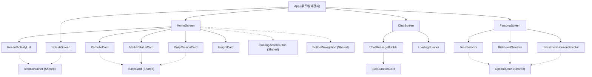

# Vesper AI Companion - 컴포넌트 구조 현황 및 개선 분석

본 문서는 리팩토링된 Vesper AI Companion 프로토타입의 React 컴포넌트 계층 구조와 아키텍처 개선 사항을 문서화합니다.

## 🌳 컴포넌트 계층 차트 (Component Tree)

## 🏗️ 구조 현황 분석

초기 프로토타입의 Monolithic(단일 파일 비대화) 구조에서 벗어나, 완벽한 모듈화(Modularization)를 달성했습니다.

### 1. 도메인별 디렉토리 분리
- `src/app/components/home/`: 대시보드 도메인 전용 컴포넌트 격리
- `src/app/components/persona/`: 파트너 설정 도메인 전용 컴포넌트 격리
- `src/app/components/shared/`: 도메인에 구애받지 않는 재사용 가능 범용 UI 컴포넌트

### 2. 디자인 시스템 추상화 (Shared Components)
반복되는 Tailwind 클래스와 레이아웃 패턴을 3개의 핵심 공통 컴포넌트로 추상화했습니다.
- **`BaseCard`**: 모든 대시보드 카드의 배경, 패딩, 테두리, 타이틀 레이아웃 통일
- **`OptionButton`**: 선택 상태에 따른 하이라이트(Amber 색상) 처리 로직 캡슐화
- **`IconContainer`**: 다양한 크기와 색상 테마를 가진 원형 아이콘 래퍼

## 🚀 향후 아키텍처 개선점 (Next Steps)

현재 프로토타입 구조는 프론트엔드 UI 관점에서 매우 훌륭하나, 실제 백엔드 연동을 위해 다음 단계의 개선이 필요합니다.

1. **상태 관리(State Management) 고도화**
   - 현재 `App.tsx`에서 모든 상태(`userName`, `messages`, `riskLevel` 등)를 Props Drilling으로 하위 컴포넌트에 넘겨주고 있습니다.
   - **개선안**: Zustand, Recoil 또는 React Context API를 도입하여 전역 상태(Global State)로 분리해야 합니다.
2. **데이터 페칭(Data Fetching) 계층 분리**
   - 현재 더미 데이터가 컴포넌트 내부에 하드코딩되어 있습니다.
   - **개선안**: React Query (TanStack Query)를 도입하여 서버 상태 관리와 캐싱, 에러 헨들링(Loading/Error States) 로직을 UI와 분리해야 합니다.
3. **라우팅(Routing) 표준화**
   - 조건부 렌더링 방식의 화면 전환을 표준 라우터로 변경해야 합니다.
   - **개선안**: `react-router-dom` 도입으로 URL 기반의 명확한 네비게이션 구조 확립.
