# Vesper AI Companion - 초정밀 컴포넌트 아키텍처 트리 (Hyper-Detailed Component Tree)

본 문서는 프론트엔드의 화면 구성 요소뿐만 아니라, **상태(State)와 속성(Props)의 흐름, 디자인 시스템(Shared UI)과의 의존성, 백엔드 API 연동 위치**까지 완벽하게 파악할 수 있도록 도식화한 엔터프라이즈 레벨의 컴포넌트 트리입니다.

## 🌳 전체 아키텍처 및 데이터 플로우 트리

```mermaid
flowchart TB
    %% Styling Definitions
    classDef root fill:#1A1A2E,stroke:#F5A623,stroke-width:3px,color:#fff
    classDef screen fill:#0A0A12,stroke:#7B61FF,stroke-width:2px,color:#fff
    classDef comp fill:#1A1A2E,stroke:#4B5563,stroke-width:1px,color:#d1d5db
    classDef shared fill:#1e1e1e,stroke:#10B981,stroke-width:1px,color:#d1d5db,stroke-dasharray: 5 5
    classDef api fill:#2D3748,stroke:#E53E3E,stroke-width:2px,color:#fff
    classDef db fill:#064E3B,stroke:#34D399,stroke-width:2px,color:#fff

    subgraph Core_Routing ["1. App Root & Global State Management"]
        App["App.tsx\n[Global State]\n- currentScreen: 'splash'|'home'|'chat'|'persona'\n- userName: string\n- personaName: string"]:::root
    end

    subgraph Main_Screens ["2. Screen Level Components (Routes)"]
        Splash["SplashScreen.tsx\n[Props]\n- onStart: () => void"]:::screen
        Home["HomeScreen.tsx\n[Props]\n- userName\n- personaName\n- onChatClick\n- onProfileClick"]:::screen
        Chat["ChatScreen.tsx\n[Props]\n- personaName\n- onBack\n[Local State]\n- messages[]\n- input, isStreaming"]:::screen
        Persona["PersonaScreen.tsx\n[Props]\n- onBack, onSave\n[Local State]\n- tone, riskLevel, horizon"]:::screen
    end

    App -- "currentScreen === 'splash'" --> Splash
    App -- "currentScreen === 'home'" --> Home
    App -- "currentScreen === 'chat'" --> Chat
    App -- "currentScreen === 'persona'" --> Persona

    subgraph Domain_Home ["3. Home Dashboard Domain"]
        Port["PortfolioCard.tsx\n- totalValue\n- profitPercentage"]:::comp
        Market["MarketStatusCard.tsx\n- (Static Mock / VIX API 연동 예정)"]:::comp
        Mission["DailyMissionCard.tsx\n- progress"]:::comp
        Activity["RecentActivityList.tsx\n- activities[]"]:::comp
        Insight["InsightCard.tsx\n- marketSummary"]:::comp
    end

    Home --> Port
    Home --> Market
    Home --> Mission
    Home --> Activity
    Home --> Insight

    subgraph Domain_Chat ["4. AI Chat Domain"]
        Bubble["ChatMessageBubble.tsx\n[Props]\n- role: 'user' | 'assistant'\n- content: string"]:::comp
        Spinner["LoadingSpinner.tsx\n(Lottie/CSS Typing Effect)"]:::comp
        B2B["B2BCurationCard.tsx\n(Markdown 렌더링 시 자동 변환)"]:::comp
    end

    Chat --> Bubble
    Chat --> Spinner
    Bubble -. "Regex 파싱 후 렌더링" .-> B2B

    subgraph Domain_Persona ["5. Persona Configuration Domain"]
        Tone["ToneSelector.tsx\n- selectedTone, onSelectTone"]:::comp
        Risk["RiskLevelSelector.tsx\n- selectedRisk, onSelectRisk"]:::comp
        Horizon["InvestmentHorizonSelector.tsx\n- selectedHorizon, onSelectHorizon"]:::comp
    end

    Persona --> Tone
    Persona --> Risk
    Persona --> Horizon

    subgraph Design_System ["6. Shared UI Components (Design System)"]
        Base["BaseCard.tsx\n- Wrapper (bg, p, rounded, border)"]:::shared
        Option["OptionButton.tsx\n- Active/Inactive 스타일 통제"]:::shared
        Icon["IconContainer.tsx\n- Size & Color Theme 매핑"]:::shared
        FAB["FloatingActionButton.tsx\n- Position Fixed (Bottom Right)"]:::shared
        Nav["BottomNavigation.tsx\n- activeTab State"]:::shared
    end

    %% Dependency Inject (UI System Usage)
    Port -. "<BaseCard>" .-> Base
    Market -. "<BaseCard>" .-> Base
    Mission -. "<BaseCard>" .-> Base
    
    Tone -. "<OptionButton>" .-> Option
    Risk -. "<OptionButton>" .-> Option
    Horizon -. "<OptionButton>" .-> Option
    
    Splash -. "<IconContainer>" .-> Icon
    Activity -. "<IconContainer>" .-> Icon
    
    Home -. "<FAB>" .-> FAB
    Home -. "<BottomNavigation>" .-> Nav
    Chat -. "<BottomNavigation>" .-> Nav

    subgraph API_BaaS ["7. Serverless & DB Dependencies"]
        ChatAPI["Edge: /api/chat\n(SSE Streaming)"]:::api
        CronPush["Edge: /api/cron-push\n(FCM 24h Nudge)"]:::api
        VectorDB[("Supabase pgvector\n(heritage_logs)")]:::db
    end

    Chat -- "POST /api/chat" --> ChatAPI
    ChatAPI <--> VectorDB
    CronPush -- "FCM Push" --> Splash
    Persona -- "Save Profile" --> VectorDB
```

## 🔍 아키텍처 상세 다이어그램 분석 가이드

위 다이어그램은 프론트엔드 엔지니어링의 핵심인 **데이터의 흐름(Data Flow)**과 **의존성(Dependencies)**을 입체적으로 표현하고 있습니다.

1. **상태 관리의 흐름 (State & Props Flow)**
   - 최상단 `App.tsx`가 `currentScreen`, `userName`, `personaName`을 Global State처럼 쥐고 있으며, 하위 스크린 컴포넌트에 Props로 데이터를 내리꽂는(Drilling) 구조임을 명시했습니다. 
   - 향후 기능 확장을 위해 이 부분은 Zustand 등의 상태 관리 라이브러리로 분리해야 함을 시사합니다.
2. **도메인별 격리 (Domain Isolation)**
   - Home, Chat, Persona 3가지 핵심 기능(Domain)이 서로의 로직에 간섭하지 않도록 폴더와 컴포넌트가 완벽히 나뉘어 있습니다.
3. **디자인 시스템 캡슐화 (Design System Encapsulation)**
   - 점선(`-.-`)으로 표시된 6번 항목(`Shared UI Components`)은 앱 전체의 디자인 일관성을 담당합니다. 버튼의 색상이나 카드의 테두리 둥기를 바꾸고 싶다면, **오직 6번 그룹 안의 컴포넌트만 수정**하면 상위 도메인 컴포넌트 전체에 자동으로 반영됩니다.
4. **BaaS/API 계층 연동 지점 (Integration Points)**
   - 붉은색 테두리의 `ChatAPI`와 초록색 테두리의 `pgvector` 데이터베이스가 어느 UI 컴포넌트와 직접 통신(I/O)하는지를 명확히 하여, 프론트엔드와 백엔드의 바운더리(Boundary)를 시각화했습니다.
