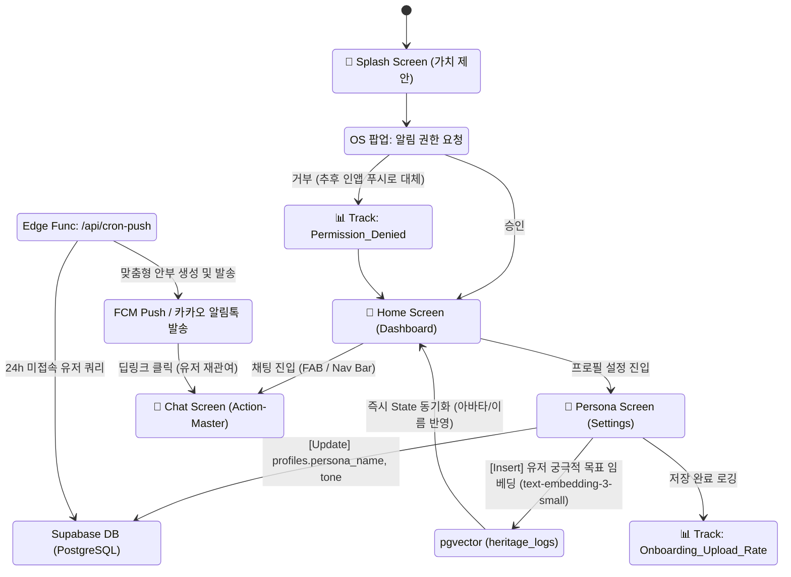
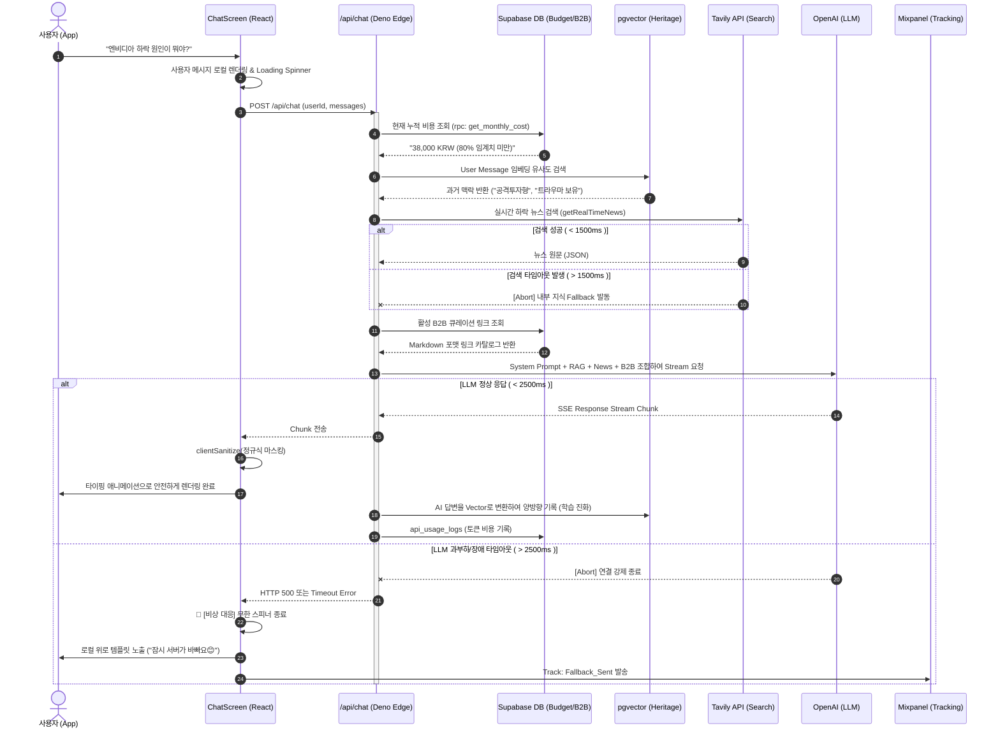
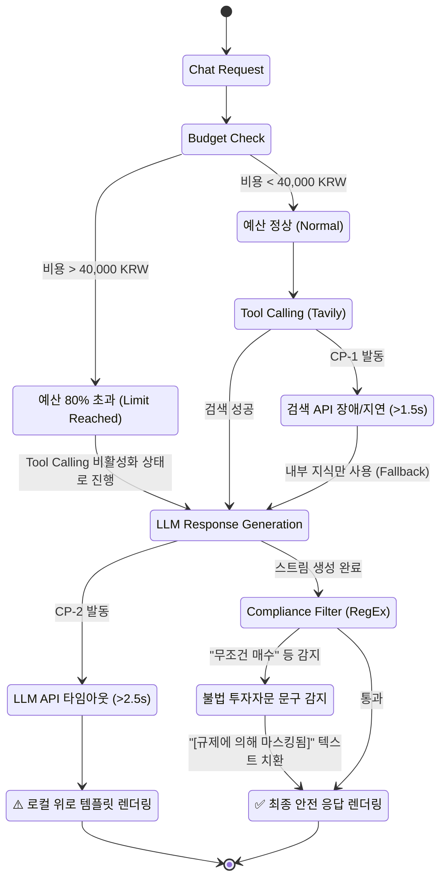

# Vesper AI Companion - 통합 아키텍처 및 스크린 플로우 다이어그램 (Enterprise Level)
**기반 문서**: `01_PRD_Final.md`, `08_Vesper_SRS_v3_HumanDev_Revised.md`

본 문서는 Vesper AI Companion의 화면 간 네비게이션은 물론, 클라이언트 앱과 백엔드 인프라(Edge Functions, pgvector, 외부 API), 그리고 데이터 트래킹 및 폴백(Fallback) 방어 체계까지 아우르는 고도화된 전체 시스템 흐름을 시각화합니다. 어떤 기능적/비기능적 명세도 생략되지 않았습니다.

---

## 1. 🌐 통합 옴니채널 시스템 및 네비게이션 아키텍처

React 클라이언트 스크린들과 Supabase BaaS, 3rd Party API 간의 상호작용 및 추적 로그(Mixpanel) 적재 지점을 모두 포함합니다.

---

## 2. ⚡ 초정밀 Chat Screen 실시간 인터랙션 시퀀스 (Tool Calling & RAG)

Vesper 시스템의 뇌(Brain) 역할을 하는 `/api/chat` Edge Function 내부의 초단위 타임아웃 제어, 예산 통제(Budget Guardrail), RAG 추출 및 실시간 검색, 그리고 규제 마스킹까지의 완벽한 흐름도입니다.

---

## 3. 🚨 예외 및 상태 전이 다이어그램 (Edge Cases State Machine)

단순 정상 플로우 외에, 시스템 장애나 정책 임계점 도달 시 Vesper가 어떻게 동작하는지를 정의한 상태 머신입니다.

### 아키텍처 다이어그램 가이드라인
본 다이어그램은 기획서 내 모든 **비기능적 요구사항(NFR)**과 **비상 대응 계획(CP 1~3)**을 UI 흐름 레벨로 끌어올린 것입니다. 프론트엔드 및 백엔드 개발자는 코드를 작성할 때 반드시 이 시퀀스의 분기점(타임아웃 수치 1500ms, 2500ms 등)과 예산 차단 로직이 구현되어 있는지 검증해야 합니다.
